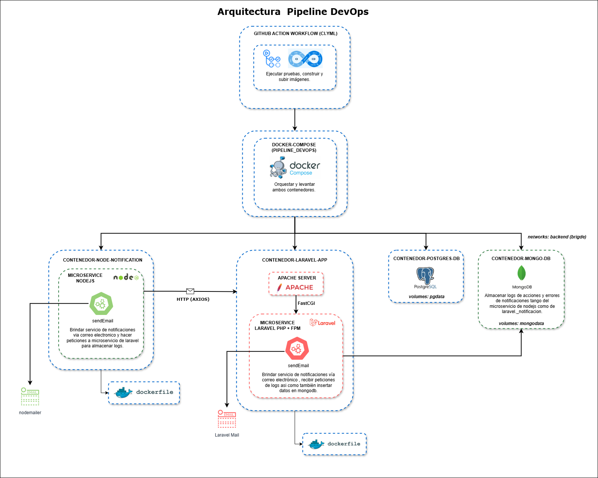

# Pipeline DevOps: Laravel Notificación Logger & Node Notifications

[](LICENSE)

## 🏗️ Arquitectura

Este sistema está diseñado como un monorepo que combina las funcionalidades dedos microservicios:

1. **Backend Laravel** (`laravel-notificacion-logger`)
   - Se encarga del manejo de notificaciones vía correo electrónico y almacena logs de acciones errores.
   - Utiliza MongoDB y PostgreSQL como bases de datos.
   - Provee una API REST para la gestión de notificaciones.
   - Utiliza Apache como servidor web para la gestión de las peticiones.
   - Utiliza PHP-FPM para la gestión de las peticiones.

2. **Servicio de Notificaciones** (`node-notifications`)
   - Maneja el envío de notificaciones por correo electrónico.
   - Actúa como servicio auxiliar para el backend Laravel, enviando vía axios logs de acciones y errores para que este los almacene en mongoDB,
   - Utiliza MongoDB para el almacenamiento de logs.

La arquitectura sigue un patrón de microservicios donde cada microservicio es orquestado por un docker-compose para que un workflow de github actions pueda construir y desplegarlos , cada microservicio tiene sus propias responsalidades y dependencias, ambos son servicios de notificaciones vía correo electrónico , se comunican entre si cuando el backend de nodejs envia una notificación vía axios enviando al backend de laravel los logs de acciones y errores para que este los almacene en mongoDB.



---

Este repositorio contiene dos proyectos principales que trabajan juntos para gestionar notificaciones: dos microservicios que comparten la misma funcion de notificaciones vía correo electrónico.

---

## 📦 Estructura del Proyecto

```
Pipeline_Devops/
│
├── laravel-notificacion-logger/
│   ├── app/
│   ├── bootstrap/
│   ├── config/
│   ├── database/
│   │   ├── migrations/
│   │   ├── seeders/
│   │   └── factories/
│   ├── public/
│   ├── resources/
│   │   ├── views/
│   │   └── lang/
│   ├── routes/
│   ├── storage/
│   ├── tests/
│   ├── vendor/
│   ├── Dockerfile
│   ├── composer.json
│   ├── .env.example
│   └── README.md
│
├── node-notifications/
│   ├── bd/
│   ├── config/
│   ├── migrations/
│   ├── seeders/
│   ├── src/
│   │   └── controllers/
│   │       └── notificationController/
│   ├── tests/
│   ├── Dockerfile
│   ├── package.json
│   ├── .env.example
│   └── README.md
│
├── docs/                            # Documentación y recursos gráficos
│   └── img/
│       └── arquitectura.png         # Imagen de arquitectura del sistema (ejemplo)
│
├── .github/
│   └── workflows/
│       └── ci.yml
│
├── docker-compose.yml
└── README.md
```

## 🚀 Instalación

### laravel-notificacion-logger

1. Entra al directorio:

   ```sh
   cd laravel-notificacion-logger
   ```

2. Instala dependencias PHP y JS:

   ```sh
   composer install
   npm install
   ```

3. Copia el archivo de entorno y configura variables:

   ```sh
   cp .env.example .env
   # Edita .env según tu configuración local
   ```

4. Genera la clave de la aplicación y ejecuta migraciones:

   ```sh
   php artisan key:generate
   php artisan migrate
   ```

5. Inicia el servidor:

   ```sh
   php artisan serve
   ```

### node-notifications

1. Entra al directorio:

   ```sh
   cd node-notifications
   ```

2. Instala dependencias:

   ```sh
   npm install
   ```

3. Configura las variables de entorno en `.env`:

   ```
   PORT=3001
   MONGO_URI=mongodb://localhost:27017/tu_db
   # Agrega tus variables de conexión a PostgreSQL
   ```

4. Ejecuta migraciones de base de datos:

   ```sh
   npm run db:migrate
   ```

5. Inicia el microservicio:

   ```sh
   npm run dev
   ```

## 🔧 Características

### Laravel Notificación Logger
- Framework Laravel 12.x
- Soporte para MongoDB y PostgreSQL
- Integración con microservicio Node.js para envío de notificaciones
- Pruebas unitarias

Para más detalles sobre la configuración y uso del microservicio Laravel, consulta el [README del proyecto Laravel Notificación Logger](laravel-notificacion-logger/README.md).

### Node Notifications
- API REST para enviar notificaciones via correo electronico
- Conexión a PostgreSQL y MongoDB
- Gestión de logs en MongoDB

Para más detalles sobre la configuración y uso del microservicio Node.js, consulta el [README del proyecto Node Notifications](node-notifications/README.md).

## 🔗 Integración

- El backend de Laravel se comunica con el microservicio Node.js para la recepción y registro de logs de acciones y errores en MongoDB.
- Ambos servicios deben estar corriendo para el funcionamiento completo del sistema.


## 🔄 CI/CD

Este proyecto utiliza GitHub Actions para automatizar el proceso de desarrollo y despliegue, separando claramente las responsabilidades:

Esta separación de responsabilidades permite:
- Desarrolladores se enfocan en el código
- Infraestructura es gestionada de forma automática
- Operaciones son más eficientes y consistentes
- Monitoreo constante del sistema


El flujo de trabajo está definido en `github/workflows/ci.yml` y se ejecuta automáticamente en estos casos:
- Push a `main`: Despliegue a producción
- Push a `develop`: Construcción y pruebas
- Pull Requests: Ejecución de pruebas
- Tags: Creación de versiones


El proceso garantiza la calidad y seguridad del código en todo momento.

## 📈 Convenciones de Desarrollo

### Git Flow

Este repositorio utiliza la estrategia **Git Flow** para la gestión de ramas:

- `main`: rama principal y estable.
- `develop`: rama de desarrollo.
- `feature/*`: nuevas funcionalidades.
- `hotfix/*`: correcciones urgentes en producción.
- `release/*`: preparación de nuevas versiones.

### Conventional Commits

Se utiliza el estándar [Conventional Commits](https://www.conventionalcommits.org/) para los mensajes de commit:

```bash
feat: nueva funcionalidad
fix: corrección de error
perf: mejoras de rendimiento
refactor: refactorización de código
docs: actualización de documentación
style: cambios de estilo
chore: tareas de mantenimiento
test: actualización de tests
```

A continuación se muestran ejemplos basicos de commits:

```bash
feat(readme):agrega documentación del readme raíz del proyecto
fix(notificacionController):corrige error en función de envio de notificaciones
refactor(docker-compose.yml):refactoriza archivo docker-compose.yml
```

## 📄 SBOM

Para ver el inventario completo de paquetes y librerías utilizadas, consulta el archivo [SBOM.md](SBOM.md) en la raíz del repositorio.

## 📄 Licencia

Este proyecto está bajo la licencia MIT. Consulta el archivo [LICENSE](LICENSE) para más detalles.

## 🤝 Contribuciones

¡Las contribuciones son bienvenidas! Por favor, sigue las convenciones de commits y el flujo de ramas descrito arriba.